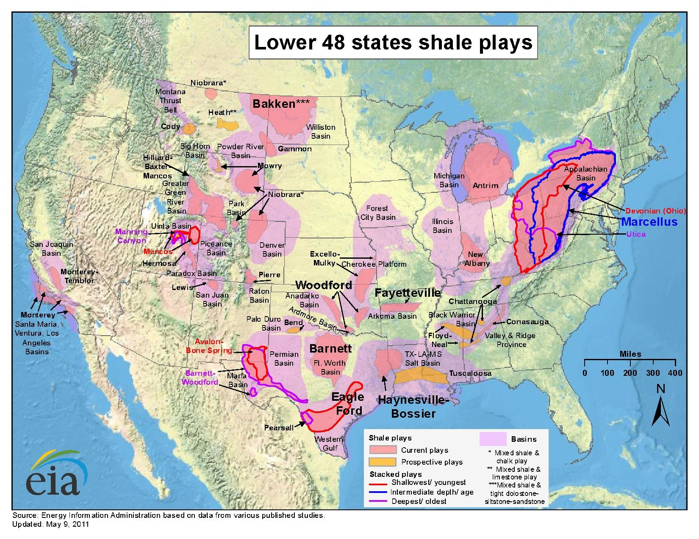
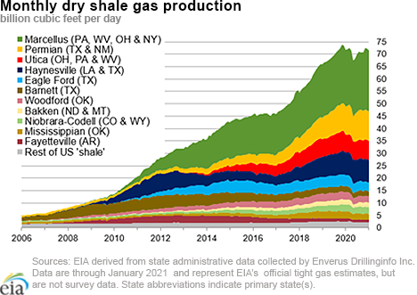

```{r setup, include=FALSE}
knitr::opts_chunk$set(echo = TRUE)
```

## Overview

### This document will provide a comparison of the [US EIA's Oil Production data](https://andrew-j-leonard.github.io/oil.html) and the [USDA's CRP Enrollment data](https://andrew-j-leonard.github.io/crp.html) using R Markdown and Tabeau. Please refer to the other pages in this site in order to learn how to extract, clean, and save this data locally.

I began my career working in the ag commodities market in 2015.  At the time, the [price of oil was plunging](https://blogs.worldbank.org/developmenttalk/what-triggered-oil-price-plunge-2014-2016-and-why-it-failed-deliver-economic-impetus-eight-charts#:~:text=The%20initial%20drop%20in%20oil,concerns%2C%20and%20shifting%20OPEC%20policies.&text=This%20partly%20explains%20why%20the,subsequent%20boost%20to%20global%20activity.) due to the increase in US shale oil production - obviously this had an [impact on the price of agricultural commodities](https://www.investopedia.com/ask/answers/030415/how-does-price-oil-affect-stock-market.asp) as well. 

The practice used in shale oil production is known as [hydraulic fracturing](https://www.usgs.gov/faqs/what-hydraulic-fracturing?qt-news_science_products=0#) AKA "fracking" which has been around since the late 1980's.  Fracking can be a controversial subject because of its [effects on the environment](https://www.usgs.gov/faqs/what-environmental-issues-are-associated-hydraulic-fracturing?qt-news_science_products=0#qt-news_science_products) so I was curious what other facets of agriculture could be affected by shale oil production.

## CRP Data

Let's begin the analysis by loading the necessary packages in R.
```{r}
library("data.table")
library("htmltools")
library("ggplot2")
suppressMessages(library("here"))
```

Load the [CRP data](https://andrew-j-leonard.github.io/crp.html) saved in the CSV file and view it.
```{r}
crp_fname <- here("Data", "usda_crp_enrollment.csv")
crp_dt <- fread(crp_fname)
head(crp_dt)
```

Let's rank states by the quantity of acres enrolled for the most recent date.  
```{r}
# Start by creating a column for the max year by state.
crp_dt[, max_year := max(year), by = state]
# Then filter where year is equal to max year.
max_crp_dt <- crp_dt[year == max_year]
# now order the data by acres (descending)
setorder(max_crp_dt, -acres)
# create a number for each row
max_crp_dt[, rank := .I]
# check top 10 rows
head(max_crp_dt, 10)
```

```{r include = FALSE}
read_html <- function(html_fname) {
  html_fname <- here(html_fname)
  includeHTML(html_fname)
}
```

I created a dashboard in [Tableau Public](https://public.tableau.com/views/AcresEnrolledinCRP/dashAllStates?:language=en-US&:display_count=n&:origin=viz_share_link) which you can interact with below:
```{r}
read_html("crp_all_states.html")
```

## Oil Data

Now let's load our [oil production data](https://andrew-j-leonard.github.io/oil.html) and view it.
```{r}
oil_fname <- here("Data", "eia_oil_production.csv")
oil_dt <- fread(oil_fname)
head(oil_dt)
```

The oil data is aggregated by month by default so we need to aggregate it by year in order to join the data with our CRP data later.
```{r}
oil_dt <- oil_dt[, .(sum_barrel = sum(barrel), avg_barrels_per_day = mean(barrels_per_day)), by = .(state_abb, state, year)]
head(oil_dt)
```

I created another dashboard in [Tableau Public](https://public.tableau.com/views/USEIAOilProduction/dashAllStatesOil?:language=en-US&:retry=yes&publish=yes&:display_count=n&:origin=viz_share_link) except using oil data which you can interact with below.
```{r}
read_html("oil_all_states.html")
```


The states we're primarily interested in are TX, ND, SD, CO, MT, NE, NM, WY, PA, WV, OH, NY, LA, OK, and AR.



## Compare 

Let's rank states by the quantity of oil produced for the most recent year that is present in both sets of data.
```{r}
max_year <- min(max(oil_dt$year), max(crp_dt$year))
max_oil_dt <- oil_dt[year == max_year]
setorder(max_oil_dt, -sum_barrel)
max_oil_dt[, rank := .I]
head(max_oil_dt, 10)
```

Let's compare that to the ranking for CRP.
```{r}
head(max_crp_dt, 10)
```


So let's go ahead and filter our oil data for only these states.
```{r}
fracking_states <- c("TX", "ND", "SD", "CO", "MT", "NE", "NM", "WY", "PA", "WV", "OH", "NY", "LA", "OK", "AR")
oil_dt <- oil_dt[state_abb %in% fracking_states]
```


I created another dashboard for only these states in [Tableau Public](https://public.tableau.com/views/AcresEnrolledinCRP/dashFrackingStates?:language=en-US&:display_count=n&:origin=viz_share_link) which you can interact with below:
```{r}
read_html("crp_fracking_states.html")
```

And I did the same thing using oil data in [Tableau Public](https://public.tableau.com/views/USEIAOilProduction/dashFrackingStatesOil?:language=en-US&publish=yes&:display_count=n&:origin=viz_share_link).
```{r}
read_html("oil_fracking_states.html")
```

Now join the CRP and Oil Production data and compare.
```{r}
DT <- merge(oil_dt, crp_dt, by = c("state", "year"))
DT <- DT[, .(avg_barrels_per_day = mean(avg_barrels_per_day), 
             acres = sum(acres)), 
         by = year]
ggplot(DT, aes(x = avg_barrels_per_day, y = acres)) + 
  geom_point() + 
  stat_summary(fun.data = mean_cl_normal) + 
  geom_smooth(method = "lm", formula = y~x)
```

We can see there are a couple of outliers.  Since fracking didn't start until the 1980's, let's filter out dates before 1990 and plot it again.
```{r}
DT <- DT[year >= 1990]
ggplot(DT, aes(x = avg_barrels_per_day, y = acres)) + 
  geom_point() + 
  stat_summary(fun.data = mean_cl_normal) + 
  geom_smooth(method = "lm", formula = y~x) +
  labs(y = "Acres Enrolled in CRP", x = "Avg Barrel per Day (1000's)")
```

Much better!  Now we can see there is a distinct linear trend between the number of acres enrolled in the Conservation Reserve Program and the average quantity (1,000's barrels) of oil produced within the same state.


```{r include = FALSE}
r_squared <- cor(DT$avg_barrels_per_day, DT$acres)**2 * 100
r_squared <- round(r_squared, 2)
r_squared <- as.character(r_squared)
```
More precisely, we can see that `r r_squared`% of the variance in the acres enrolled in CRP can be explained by the variance in the average number of barrels of crude produced in these same states. 
```{r}
mod <- lm(acres ~ avg_barrels_per_day, DT)
summary(mod)
```