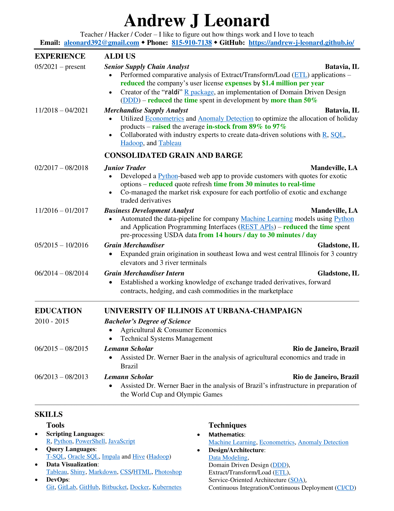

```{r setup, include=FALSE}
knitr::opts_chunk$set(echo = TRUE)
```

## You can navigate this site using the navbar at the top.

### Feel free to download a copy of my resume <u>[here](Img/Andrew Leonard - Resume.pdf)</u>:


